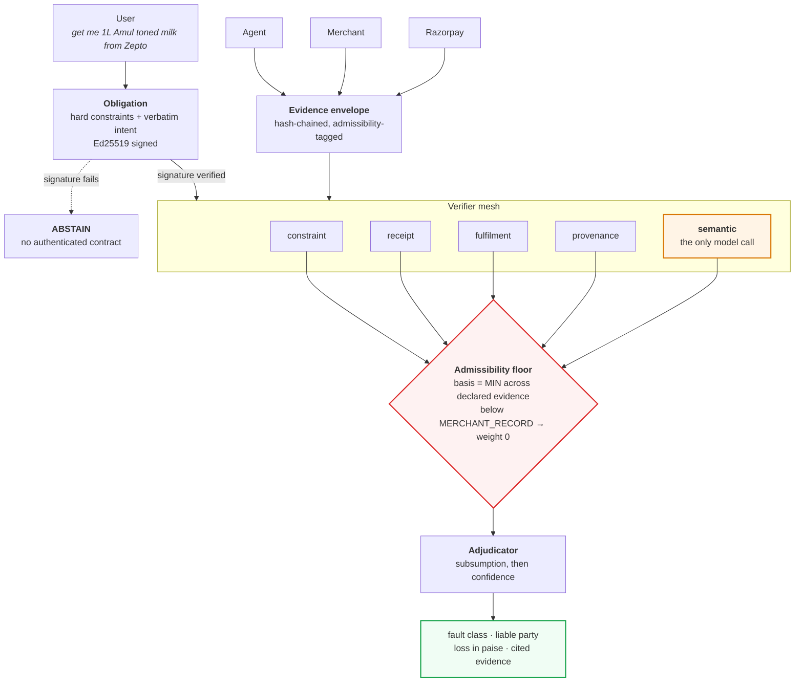
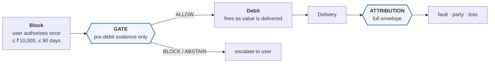
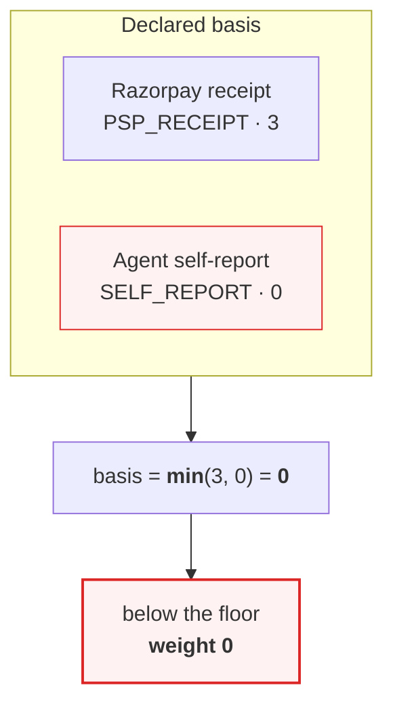

# Architecture

## The decision path

Four of five verifiers never call a model. The fifth runs only when nothing cheaper has settled the matter.

## Where the money is

UPI Reserve Pay uses Single Block Multi Debit: funds are blocked once and debited repeatedly as value arrives. Both modes run the same verifiers over the same evidence — the gate simply cannot see what has not happened yet.

Fulfilment records, agent self-reports and user disputes are all post-debit. That is measured, not asserted: **`17.0%` of failures in the benchmark are unreachable by any pre-debit control.**

## Why a strong receipt does not rescue a weak claim

The basis class is the **meet**, not the join. Consulting strong evidence alongside weak evidence does not launder the weak evidence — the weak item is still load-bearing, so the verdict is only as strong as it.

This is what stops a fluent, confident model verdict built on the agent's own account of itself from reaching a decision. Measured in the ablation: **`215` verdicts discarded**, every one of them persuasive.

## Evidence classes

| class | rank | source | why that rank |
|---|---:|---|---|
| `SELF_REPORT` | 0 | the agent | an agent that bought the wrong thing will report buying the right one |
| `SELF_SIGNED` | 1 | the agent, signed | signing proves authorship, not honesty |
| `MERCHANT_RECORD` | 2 | merchant order and fulfilment | external to the agent; interested in disputes naming it |
| `PSP_RECEIPT` | 3 | Razorpay order and payment | external to both, uninterested in an intent dispute |

`MERCHANT_RECORD` and `PSP_RECEIPT` attest different things — what was ordered and shipped, versus what was charged — and in a fuller model would be incomparable rather than ranked. They are totally ordered here for tractability.